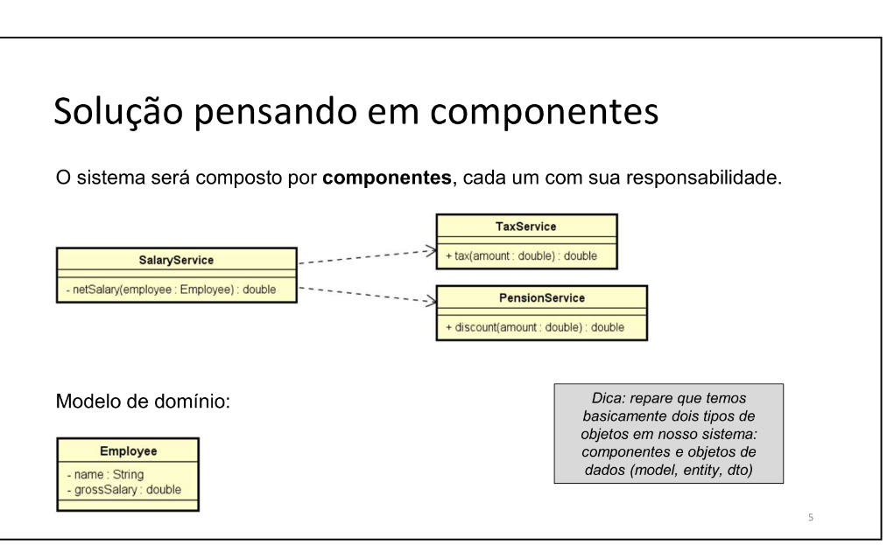

#  SISTEMA x COMPONENTES

---

## Sistema

- Um sistema é composto por componentes

--- 

## Componentes devem 
- Coesos (Responsábilidade clara e única)
- Desacoplados entre si (baixo acoplamento)

---

## Objetivos
- Flexiblidade
- Manutençao facilitada
- Reaproveitamento 

---

## Inversão de Controle

### Analogia do carro

- No carro, o motor depende da bateria, porém a base de encaixe da bateria é fora do motor
 
- Por que não colocar a base da bateria dentro do motor?
  - Porque se for preciso trocar a bateria, não é preciso abrir o motor.

### Generalizando

- Se um componente A depende de B, A NÃO deve ter o controle sobre esta dependência (B).

- Por que?
  - Porque se for preciso trocar a dependência (B), seria preciso também abrir o componente A.

- É preciso "inverter o controle", ou seja o controle da depedência tem que ficar fora do componente A.

---

